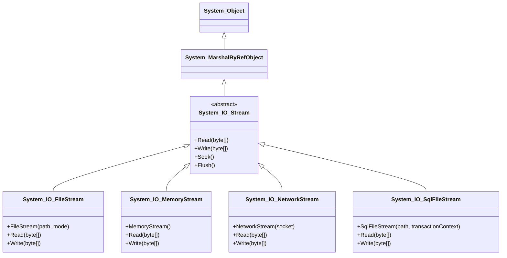

# 🧾 설명 요약
- System.IO.Stream은 추상 클래스로, 모든 스트림의 기반이 됩니다.
- FileStream, MemoryStream, NetworkStream, SqlFileStream은 이를 상속하여 각각의 입출력 시나리오에 맞게 구현됩니다.
- System.Object → MarshalByRefObject → Stream 순으로 상속 계층이 이어집니다.
- 각 스트림 클래스는 Read, Write 메서드를 통해 byte[] 배열을 다룹니다.

```
using System.IO 선언

// FileStream
// 파일 입출력을 다루는 기본 클래스

System.Object 
    System.MarshalByRefObject
        System.IO.Stream
            System.IO.FileStream

//byte[] 배열로 데이터를 읽거나 저장함.

```


