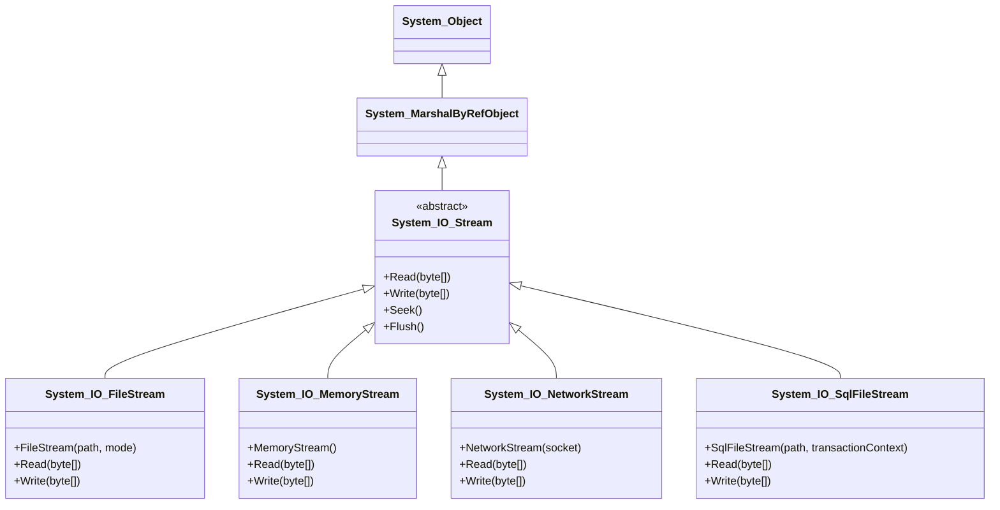

# 📦 FileStream 생성 방식 요약
| 변수명 | 생성 방식 | 접근 권한 | 설명 |
|--------|-----------|------------|------|
| `fs1`  | `File.OpenRead("readme.bin")` | 읽기 전용 | 기존 파일을 읽기 전용으로 엽니다 |
| `fs2`  | `File.OpenWrite(@"c:\temp\writeme.tmp")` | 쓰기 전용 | 기존 파일을 쓰기 전용으로 엽니다 (없으면 생성) |
| `fs3`  | `File.Create(@"c:\temp\writeme.tmp")` | 읽기/쓰기 | 새 파일을 생성하고 읽기/쓰기 가능 |
| `fs`   | `new FileStream("readwrite.tmp", FileMode.Open)` | 읽기/쓰기 | 기존 파일을 열고 읽기/쓰기 가능 |


## 🗂️ 경로 처리 관련 코드
```csharp
string baseFolder = AppDomain.CurrentDomain.BaseDirectory;
string strFile = Path.Combine(baseFolder, "test.txt");
```

- AppDomain.CurrentDomain.BaseDirectory: 현재 실행 중인 애플리케이션의 루트 경로
- Path.Combine(...): 경로를 안전하게 연결하여 "루트경로\test.txt" 형태의 전체 경로 생성

## 🧠 핵심 개념 요약
- FileStream은 바이트 단위 입출력을 위한 클래스
- File.OpenRead / OpenWrite / Create는 편의 메서드로, FileStream을 쉽게 생성
- FileStream 생성 시 FileMode, FileAccess, FileShare 등을 직접 지정할 수 있음
- 경로는 Path.Combine과 AppDomain.CurrentDomain.BaseDirectory를 활용하면 환경 독립적인 파일 경로를 만들 수 있음



---
